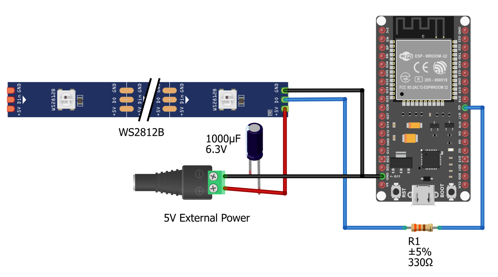

# Wifi-Controlled LED
This project is an LED Strip that can be controlled from your own browser. The LED color can be customized to be any static color, or follow one of four preset modes which automatically customize the color over time.

| **Engineer** | **School** | **Area of Interest** | **Grade** |
|:--:|:--:|:--:|:--:|
| Anderson E | EHS | Computer Science/Cybersecurity | Incoming Senior


  
# Final Milestone - Add Automatic Modes to Code

<iframe width="560" height="315" src="https://www.youtube.com/embed/EOxmQoZJnlc" title="YouTube video player" frameborder="0" allow="accelerometer; autoplay; clipboard-write; encrypted-media; gyroscope; picture-in-picture; web-share" referrerpolicy="strict-origin-when-cross-origin" allowfullscreen></iframe>

Since my previous milestone, I've added a dropdown to the website which contains multiple preset animations for the LED strip. Overall, the most difficult challenge I faced was when my LED strip didn't turn on after a pin had loosened and didn't provide and electricity. My biggest triumph was when I was able to make my hardware turn on and fully work. I learned about voltage, current, the ESP32, Arduino C++, and how an LED strip works. I hope to learn more about hardware in the future after Bluestamp.

# Second Milestone - Working WiFi Color Server

<iframe width="560" height="315" src="https://www.youtube.com/embed/_Y7RiGL3Ee8" title="YouTube video player" frameborder="0" allow="accelerometer; autoplay; clipboard-write; encrypted-media; gyroscope; picture-in-picture; web-share" allowfullscreen></iframe>
At Milestone 2, I've now modified code which was needed to allow changing the color remotely. The ESP32 now hosts an HTTP server on the local network, which hosts the controls for changing the LED strips color. Surprisingly, the WiFi part of the code worked first try, and I was able to connect to the server and change the color. However, the color didn't change in the way I expected. It turns out that the LED strip takes the GRB encoding of colors, while the code was set to send the RGB encoding. This caused red to appear on the LED as green, and green to appear as red. I switched the encoding and it worked fine after. Next, I'm going to remake the code for the server since I don't like it's format, and then I will add more controls, like being able to cycle through colors.

# First Milestone - Completed Hardware

<iframe width="560" height="315" src="https://www.youtube.com/embed/vXvqL7_d3vs" title="YouTube video player" frameborder="0" allow="accelerometer; autoplay; clipboard-write; encrypted-media; gyroscope; picture-in-picture; web-share" referrerpolicy="strict-origin-when-cross-origin" allowfullscreen></iframe>

My project is an LED Strip that can be controlled remotely via Wifi. The main idea is that the LED will connect to the local Wifi network, and host an http site with controls for color of the lighting. So far, I've been able to complete all the wiring and get the LED strip to light up, controlled by code from the ESP32. When I first tried to control the LED strip through the ESP32, it ended up just flashing every light random colors. It turns out the ESP32 was not securely pushed into the breadboard, which wasn't apparent at the time. Now I'm going modify some code to work with the LED strips that I am using.

# Schematic


# Code
I modified existing code to work with the LED strip I used, and added additional features.
```cpp
/*********
  Rui Santos
  Complete project details at https://randomnerdtutorials.com  
*********/

// Load Wi-Fi library
#include <WiFi.h>
#include <Adafruit_NeoPixel.h>
#include <string>
#include <vector>
#define LED_PIN 5
#define LED_COUNT 60
Adafruit_NeoPixel strip(LED_COUNT, LED_PIN, NEO_GRB + NEO_KHZ400);

// Replace with your network credentials
const char* ssid     = "WIFI_SSID_HERE";
const char* password = "WIFI_PASSWORD_HERE";

// Set web server port number to 80
WiFiServer server(80);

// Decode HTTP GET value
String redString = "0";
String greenString = "0";
String blueString = "0";
int pos1 = 0;
int pos2 = 0;
int pos3 = 0;
int pos4 = 0;

// Decode Mode
String mode="";

// Variable to store the HTTP req  uest
String header;

// Setting PWM frequency, channels and bit resolution
const int freq = 5000;
// Current time
unsigned long currentTime = millis();
// Previous time
unsigned long previousTime = 0; 
// Define timeout time in milliseconds (example: 2000ms = 2s)
const long timeoutTime = 2000;

uint32_t colorH=0;
float breath=0;
int switchTime=0;

// hsv to rgb is from ChatGPT
// hsv is used for color cycling since its easier to change the color based on hue
uint32_t HSVtoRGB(uint8_t h, uint8_t s, uint8_t v)
{
    uint8_t r, g, b;

    if (s == 0) {
        r = g = b = v;
    } else {
        uint8_t region = h / 43;
        uint8_t remainder = (h - region * 43) * 6;

        uint8_t p = (v * (255 - s)) >> 8;
        uint8_t q = (v * (255 - ((s * remainder) >> 8))) >> 8;
        uint8_t t = (v * (255 - ((s * (255 - remainder)) >> 8))) >> 8;

        switch (region) {
            case 0: r = v; g = t; b = p; break;
            case 1: r = q; g = v; b = p; break;
            case 2: r = p; g = v; b = t; break;
            case 3: r = p; g = q; b = v; break;
            case 4: r = t; g = p; b = v; break;
            default: r = v; g = p; b = q; break;
        }
    }

    return ((uint32_t)r << 16) |
           ((uint32_t)g << 8)  |
           (uint32_t)b;
}

void fillStrip(uint32_t color) {
  fillStrip(color, true);
}

void fillStrip(uint32_t color, bool show) {
  for (int i = 0; i<LED_COUNT; i++) {
    strip.setPixelColor(i, color);
  }
  if (show) {
    strip.show();
  }
}

void setup() {
  strip.begin();
  strip.show();
  Serial.begin(115200);
  fillStrip(strip.Color(0, 0, 0));
  
  // Connect to Wi-Fi network with SSID and password
  Serial.print("Connecting to ");
  Serial.println(ssid);
  WiFi.begin(ssid, password);
  int l=0;
  while (WiFi.status() != WL_CONNECTED) {
    delay(25);
    if (l%20==19) {
      Serial.print(".");
    }
    l+=1;
    fillStrip(strip.Color(0, 0, 0), false);
    strip.setPixelColor(l%LED_COUNT, strip.Color(127, 127, 127));
    strip.show();
  }
  fillStrip(strip.Color(0, 0, 127));
  // Print local IP address and start web server
  Serial.println("");
  Serial.println("WiFi connected.");
  Serial.println("IP address: ");
  Serial.println(WiFi.localIP());
  server.begin();
}

void loop(){
  WiFiClient client = server.available();   // Listen for incoming clients

  if (client) {                             // If a new client connects,
    currentTime = millis();
    previousTime = currentTime;
    Serial.println("New Client.");          // print a message out in the serial port
    String currentLine = "";                // make a String to hold incoming data from the client
    while (client.connected() && currentTime - previousTime <= timeoutTime) {            // loop while the client's connected
      currentTime = millis();
      if (client.available()) {             // if there's bytes to read from the client,
        char c = client.read();             // read a byte, then
        Serial.write(c);                    // print it out the serial monitor
        header += c;
        if (c == '\n') {                    // if the byte is a newline character
          // if the current line is blank, you got two newline characters in a row.
          // that's the end of the client HTTP request, so send a response:
          if (currentLine.length() == 0) {
            // HTTP headers always start with a response code (e.g. HTTP/1.1 200 OK)
            // and a content-type so the client knows what's coming, then a blank line:
            client.println("HTTP/1.1 200 OK");
                   
            if(header.indexOf("GET /") >= 0) {
              // Display the HTML web page
              client.println("Content-type: text/html");
              client.println("Connection: close");
              client.println();
              client.println("<!DOCTYPE html><html>");
              client.println("<head><meta name=\"viewport\" content=\"width=device-width, initial-scale=1\">");
              client.println("<link rel=\"icon\" href=\"data:,\">");
              client.println("<link rel=\"stylesheet\" href=\"https://stackpath.bootstrapcdn.com/bootstrap/4.3.1/css/bootstrap.min.css\">");
              client.println("<script src=\"https://cdnjs.cloudflare.com/ajax/libs/jscolor/2.0.4/jscolor.min.js\"></script>");
              client.println("</head><body><div class=\"container\"><div class=\"row\"><h1>ESP Color Picker</h1></div>");
              client.println("<input class=\"btn btn-primary btn-lg\" href=\"#\" id=\"change_color\" type=\"button\" onclick=\"setRGB()\" value=\"Change Color\"></input> ");
              client.println("<input class=\"jscolor {onFineChange:'update(this)'}\" id=\"rgb\">");
              client.println("<select name=\"modes\" id=\"modes\"><option value=\"static\">Static</option><option value=\"cycle\">Cycle</option><option value=\"breath\">Breath</option><option value=\"wave\">Wave</option><option value=\"switch\">Switch</option></select></div>");
              client.println("<script>var rgbvalue=\"?r255g255b255&\";\nfunction update(picker) {document.getElementById('rgb').innerHTML = Math.round(picker.rgb[0]) + ', ' +  Math.round(picker.rgb[1]) + ', ' + Math.round(picker.rgb[2]);");
              client.println("rgbvalue=\"?r\" + Math.round(picker.rgb[0]) + \"g\" +  Math.round(picker.rgb[1]) + \"b\" + Math.round(picker.rgb[2]) + \"&\";}\nfunction setRGB() {fetch(rgbvalue+\"mode=\"+modes.value+\";\", {method: \"POST\"});}</script></body></html>");
              // The HTTP response ends with another blank line
              client.println();
            } else if (header.indexOf("POST ")>=0) {
              if (header.indexOf("mode=")) {
                pos1 = header.indexOf('=');
                pos2 = header.indexOf(';');
                mode = header.substring(pos1+1, pos2);
              } else {
                mode = "static";
              }

              if (mode=="static" && header.indexOf("/?r")>=0) {
                // Request sample: /?r201g32b255&
                // Red = 201 | Green = 32 | Blue = 255
                pos1 = header.indexOf('r');
                pos2 = header.indexOf('g');
                pos3 = header.indexOf('b');
                pos4 = header.indexOf('&');
                redString = header.substring(pos1+1, pos2);
                greenString = header.substring(pos2+1, pos3);
                blueString = header.substring(pos3+1, pos4);
                mode="static";
                /*Serial.println(redString.toInt());
                Serial.println(greenString.toInt());
                Serial.println(blueString.toInt());*/
                fillStrip(strip.Color(redString.toInt(), greenString.toInt(), blueString.toInt()));
                client.println("Content-type: application/json");
                client.printf("Content-Length: %d\r\n", (strlen("{\"request\":{\"r\":, \"g\":, \"b\":}, \"result\":\"success\"}")+redString.length()+greenString.length()+blueString.length()));
                client.println("Connection: close");
                client.println();
                client.printf("{\"request\":{\"r\":%s, \"g\":%s, \"b\":%s}, \"result\":\"success\"}", redString, greenString, blueString);
              } else {
                client.println("Content-type: application/json");
                client.printf("Content-Length: %d\r\n", (strlen("{\"request\":{\"mode\":\"\"}, \"result\":\"success\"}")+mode.length()));
                client.println("Connection: close");
                client.println();
                client.printf("{\"request\":{\"mode\":\"%s\"}, \"result\":\"success\"}", mode);
              }
            }
            // Break out of the while loop
            break;
          } else { // if you got a newline, then clear currentLine
            currentLine = "";
          }
        } else if (c != '\r') {  // if you got anything else but a carriage return character,
          currentLine += c;      // add it to the end of the currentLine
        }
      }
    }
    // Clear the header variable
    header = "";
    // Close the connection
    client.stop();
    Serial.println("Client disconnected.");
    Serial.println("");
  }

  if (mode=="cycle") {
    colorH++;
    if (colorH>=256*4) {
      colorH=0;
    }
    fillStrip(HSVtoRGB(colorH/4, 255, 50));
  } else if (mode=="breath") {
    breath++;
    if (breath>=300) {
      breath=0;
    }
    fillStrip(strip.Color(0, 0, (std::sin(breath/150*3.14159265358979)+1)*100)); // as many digits of pi as i couuld remember
  } else if (mode=="wave") {
    colorH++;
    if (colorH>=256*2) {
      colorH=0;
    }
    for (int i = 0; i<LED_COUNT; i++) {
      strip.setPixelColor(i, HSVtoRGB((colorH+i*4)/2, 255, 50));
    }
    strip.show();
  } else if (mode=="switch") {
    switchTime++;
    if (switchTime>=100) {
      switchTime=0;
    }
    bool current = switchTime>50;
    for (int i = 0; i<LED_COUNT; i++) {
      current=!current;
      int color = current ? 0 : 127;
      strip.setPixelColor(i, strip.Color(color, color, color));
    }
    strip.show();
  }
  delay(10);
}
```

# Bill of Materials

| **Part** | **Note** | **Price** | **Link** |
|:--:|:--:|:--:|:--:|
| ESP32 | Main Controller for Wifi | $5.99 | <a href="https://www.ebay.com/itm/177335070401"> Link </a> |
| RGB LED Strip (5V) | Producing Colored Lighting | $6.11 | <a href="https://www.banggood.com/0_5-or-1-or-2-or-3-or-4-or-5M-SMD5050-RGB-LED-Strip-Lamp-Bar-TV-Backlilghting-Kit-+-USB-Remote-Control-DC5V-p-1135234.html"> Link </a> |
| 3x NPN transistors | Controlling Electricity to the Lights | $6.99 | <a href="https://www.amazon.com/BOJACK-2N2222-General-Purpose-Transistors/dp/B07T61M92G"> Link </a> |
| 3x 1k ohm resistors | Managing Current | $14.97 | <a href="https://www.aliexpress.us/item/2255801159200038.html"> Link </a> |
| Jumper Wires | Connecting Components | $4.63 | <a href="https://www.banggood.com/Geekcreit-3-IN-1-120pcs-10cm-Male-To-Female-Female-To-Female-Male-To-Male-Jumper-Cable-For-p-1054670.html"> Link </a> |
| Breadboard | Holding all the components | $2.47 | <a href="https://www.ebay.com/itm/382565420137"> Link </a> |

# Resources
<a href="https://randomnerdtutorials.com/esp32-esp8266-rgb-led-strip-web-server/"> https://randomnerdtutorials.com/esp32-esp8266-rgb-led-strip-web-server/ </a>

<a href="https://www.sunfounder.com/blogs/news/esp32-with-ws2812b-neopixel-leds-complete-beginner-s-guide"> https://www.sunfounder.com/blogs/news/esp32-with-ws2812b-neopixel-leds-complete-beginner-s-guide </a>
